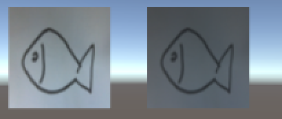

Title: 改变图片亮度
Date: 2015-09-15 22:26
Modified: 2015-09-15 22:28
Status: published
Category: Unity
Tags: Unity, Graphic
Keywords: Unity, Texture brighten

有的时候我们有可能有需求将较暗的图像简单的提亮，这篇文章主要讲一种改变图片亮度的方式。我们从两个问题入手：

- 为了提亮图片，我们操作的对象是什么？
- 怎么操作对象能达到提亮的效果？

###Unity 中的 Color
首先我们来回答第一个问题。聪明的你可能已经知道，我们要操作的对象是 **像素** 。Unity 中 Color 
类的一个实例能表示一个像素点。

Color 类有 4 个字段表示颜色的各通道数值，他们分别是：

- `r` 红色通道
- `g` 绿色通道
- `b` 蓝色通道
- `a` aplha通道

各个通道的数值都是被标准化为 `0...1` 之间的值。

###提亮算法

上面 Color 各通道的数值都被标准化，这里我们也依葫芦画瓢来把我们要提高的亮度 brightness 一个数值，不过我们设定它的取值区间为
`-1...1`。当 brightness 为负数的时候，图片减暗，正数时，图片变亮。

算法, 假设 RGB 通道值为 c：

- 当 brightness < 0 时 c = c + c * brightness
- 当 brightness >= 0 时 c = c + c * ( 1 / (1 - brightness) - 1)

###代码实现：

结合上面两个点，我们可以写出类似下面示例代码实现。

	:::C#
	using UnityEngine;

	public class BrightenScript : MonoBehaviour {
		
		[RangeAttribute(-1, 1)]
		public float brightness = 0;
		public Texture2D texture;
		
		void Start () {
			Brighten(texture, brightness);
			GetComponent<Renderer>().material.mainTexture = texture;
		}
		
		private void Brighten(Texture2D texture, float brightness)
		{
			Color[] colors = texture.GetPixels();
			
			// 对 RGB 通道都做处理
			//
			for (int i = 0; i < colors.Length; i++)
			{
				colors[i].r = BrightenChannel(colors[i].r, brightness);
				colors[i].g = BrightenChannel(colors[i].g, brightness);
				colors[i].b = BrightenChannel(colors[i].b, brightness);
			}
			
			texture.SetPixels(colors);
			texture.Apply();
		}
		
		
		private float BrightenChannel(float c, float brightness)
		{
			if(brightness < 0)
			{
				return c + c * brightness;
			}
			else
			{
				return c + c * (1 / (1 - brightness) - 1);
			}
		}
	}

brightness 为 0.6 时效果如下：

{: width="24%"} 

brightness 为 -0.5 时效果如下：

{: width="24%"}