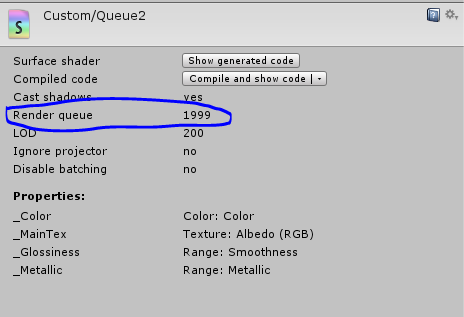

Title: 瞎聊 Unity Shader 系列之七：究竟谁先被渲染？
Date: 2015-05-06 16:05
Modified: 2015-05-07 16:13
Category: Shader
Tags: Shader
Status: published

这节的问题: 假设有很多对象需要渲染，而你想自己指定这些对象被渲染的顺序的话应该怎么做？

先上答案：使用 Subshader 的 Queue 标签指定。

那 Queue 标签又是是那么？？ 我们继续往下看，先介绍 Subshader 的标签

###Subshader 的标签

在上一节 [初识 Shaderlab]({filename}/Shader_6.md) 中我们知道 Subshader 语句块内有个 `[Tags]` 可选项，它的作用是是配置渲染引擎应该 **什么时候 和 怎么样** 去渲染。这就是 Subshader 的标签。

它的语法是：

> Tags { "TagName1" = "Value1" "TagName2" = "Value2" ... }

就是 Tags 语法块内带有若干键值对项（理论上可有很多很多个这种键值对）。可以填写的些键值对可以参考 [这个页面](http://docs.unity3d.com/Manual/SL-SubshaderTags.html)

需要注意一点 **它只能写在 Subshader 语句块里面，不能写在 Pass 语句块里面**。

###Queue 标签

Queue 标签是上面提到的可选键值对项中的一个，也就是决定对象被渲染顺序的标签。根据上面的语法，我们可以这么写：

> Tags { "Queue" = "XXXX" }

上面的 `XXXX` 是 Queue 标签的值，这个值在内部是整数型的索引。**数值越小，越先被渲染**。但是不要以为直接填整数就可以，Shaderlab 不支持直接填数值，而是先定义好了 5 个具有描述性的词来代替单调的数值。他们是：

- **Background：** 对应数值为 1000，用于需要被最先渲染的对象，如背景什么的。
- **Geometry：** 对应数值为 2000, 用于不透明的物体。这个是默认的选项（如果不指明 Queue 标签的值，自动给你指定为 Geometry）。
- **AlphaTest：** 对应的数值为 2450, 用于需要使用 AlphaTest 的对象来提高性能。AlphaTest 类似于裁剪 (clip) 功能。
- **Transparent：** 对应的数值为 3000， 用于需要使用 alpha blending 的对象，比如粒子，玻璃等。
- **Overlay：** 对应的数值为 4000，用于最后被渲染的对象，比如 UI。

渲染顺序的示意图如下：

{: width="73%"}

前面提到虽然 Queue 内部是整型数值，但是写 shader 的时候不能给它指定整型数值，那要是前置给它指定为整型数值会怎么样？

答案是：会被忽略，使用默认的值，也就是 Geometry。同样的，随便填写的值也是会被忽略并使用默认值代替。 比如 `asd1123`。

还有 Shaderlab 还对上面五类做了延伸，让他们 **支持加减法**。比如想让对象在 Background 之后 Geometry 之前渲染，我们可以这么写:

> Tags { "Queue" = "Geometry-1"}

这里有几点比较重要：

- `Geometry-1` 中间不能有空格
- 这个语法是整型数值的加减法。 `Geometry-1` 和 `Background+999` 得到的结果是一样的，因为 2000 - 1 = 1000 + 999。

我们在 Unity 编辑器里面选中 shader 文件，然后从 Inspector 里查看 Shader 的 Render queue 属性值，如下图：

{: width="60%"}

最后基于上一节 [初识 Shaderlab]({filename}/Shader_6.md) 中的精简骨架，我们来写一个伪代码，看看插入 Queue 标签后的样子。  

    :::cuda
    Shader "shader 的名字" {

      SubShader {
        Tags { "Queue" = "Transparent" }

        Pass {

        }
      }
    }

###系列文章目录
- [瞎聊 Unity Shader 系列之一：GPU 与 Shader Model]({filename}/Shader_1.md)
- [瞎聊 Unity Shader 系列之二：渲染管线]({filename}/Shader_2.md)
- [瞎聊 Unity Shader 系列之三：Shader 土地上的语言们]({filename}/Shader_3.md)
- [瞎聊 Unity Shader 系列之四：坐标系]({filename}/Shader_4.md)
- [瞎聊 Unity Shader 系列之五：RGBA 101]({filename}/Shader_5.md)
- [瞎聊 Unity Shader 系列之六：初识 Shaderlab]({filename}/Shader_6.md)
- [瞎聊 Unity Shader 系列之七：究竟谁先被渲染？]({filename}/Shader_7.md)
- [瞎聊 Unity Shader 系列之八：#pragma 指令]({filename}/Shader_8.md)
- [瞎聊 Unity Shader 系列之九：用来包装变量的 Properties]({filename}/Shader_9.md)
