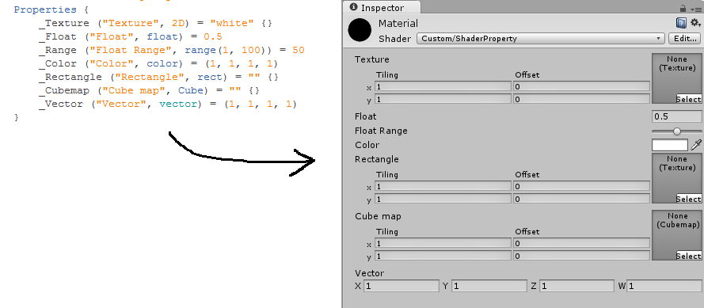

Title: 瞎聊 Unity3D Shader 系列之九：用来包装变量的 Properties
Date: 2015-05-08 14:03
Modified: 2015-05-08 14:13
Category: Shader
Tags: Shader
Status: published

为了像其他程序语言一样重用代码，Shaderlab 把可变部分提取出来，集中放到一个区域去。这个区域就是 [初始 shaderlab]({filename}/Shader_6.md) 这节中提到的的 `Properties`
可选项。 在这个区域内每一个元素被叫做 Property。我们把他叫做属性吧。这些属性都包括在 `Properties { }` 语句块内。

###Shaderlab 的属性

属性的语法是:

> 属性名 ("Inspector 显示的名字", 类型) = 默认值

Shaderlab 提供不同的数据类型（详情见下面）。如果把这些类型和默认值格式填充进上面的语法后，会变成下面的样子：

> 数值类：
>> name ("display name", Range (min, max)) = number  
>> name ("display name", Float) = number  
>> name ("display name", Int) = number  
>> name ("display name", Color) = (number,number,number,number)  
>> name ("display name", Vector) = (number,number,number,number)  

> 纹理类：
>> name ("display name", 2D) = "defaulttexture" {}  
>> name ("display name", Cube) = "defaulttexture" {}  
>> name ("display name", 3D) = "defaulttexture" {}  

上面 `defaulttexture` 可以是 “white”, “black”, “gray” 或者 “bump”。

对应在 Inspector 不同类型显示的默认样式如图所示：

{: width="100%"}

上面是默认样式，最后显示的样式还可以自己定制，详情可以参考 [这个页面](http://docs.unity3d.com/ScriptReference/MaterialPropertyDrawer.html)。

需要说明下，还有个 Rect 类型，在官方手册介绍 [Properties 的介绍页面](http://docs.unity3d.com/Manual/SL-Properties.html) 中没有提到。估计是 Unity5 之后去掉了。

注意，在 `Properites` 语句块里面声明完了，如果要被 CG 等语言关联上，**还需要在 `CGPROGRAM ... ENDCG` 语句块内 再次声明同名字的变量 后属性才起作用**。这个从逻辑上
好理解，因为要被 CG 等语言利用，所以应该跟 CG 等语言放在一起，而 CG 等语言程序就包括在 `CGPROGRAM ... ENDCG` 语句块内。

###与 CG 等语言变量类型映射关系

Shaderlab 提供的类型最终会映射成 CG 等语言变量类型，他们的映射关系为：

- **Color** 和 **Vector** 对应为 float4, half4 或者 fixed4 类型
- **Range** 和 **Float** 对应为 float, half, fixed 类型
- **Int** 对应为 int 类型
- **2D** 对应为 sampler2D 类型
- **Cube** 对应为 samplerCUBE 类型
- **3D** 对应为 sampler3D 类型

上面可以看到，有些属性是可以对应成好几类类型。Float 是 32 位高精度浮点数, half 是 16 位中等精度浮点数, Fixed 一般是 11 低位浮点数。为了性能建议使用的数据选择合适的类型。
下面有两个建议（在移动设备上尤其重要）：

- 对于 Color 和 单位向量，使用 fixed 类型
- 对于其他的类型，如果范围和精度都适合的话选择 half, 否则选择 float

最后放上上面的图片所用的 shader 代码：

    :::cuda
    Shader "Custom/Properties" {
    	Properties {
    		_RangeType ("Range 类型", Range(0,1)) = 0.5
    		_FloatType ("Float 类型", Float) = 1.0
    		_IntType ("Int 类型", Int) = 1
    		_ColorType ("Color 类型", Color) = (1, 1, 1, 1)
    		_VectorType ("Vector 类型", vector) = (0, 0, 0, 0)
    		_2DType ("2D纹理类型", 2D) = "while" {}
    		_CubeType ("Cube 类型", Cube) = "black" {}
    		_3DType ("3D纹理类型", 3D) = "gray" {}
    		_RectType("Rectangle", Rect) = "" {}
    	}

    	SubShader {
    		Tags { "RenderType"="Opaque" }
    		LOD 200

    		CGPROGRAM

    		#pragma surface surf Standard fullforwardshadows
    		#pragma target 3.0

    		// 再次声明跟属性一样的名字的变量
    		float _RangeType;
    		float _FloatType;
    		int _IntType;
    		fixed4 _ColorType;
    		float4 _VectorType;
    		sampler2D _2DType;
    		samplerCUBE _CubeType;
    		sampler3D _3DType;
    		float4 _RectType;

    		struct Input {
    			float2 uv_MainTex;
    		};

    		void surf (Input IN, inout SurfaceOutputStandard o) {
    			o.Alpha = (0, 0, 0, 0);
    		}

    		ENDCG
    	}
    }

###系列文章目录
- [瞎聊 Unity3D Shader 系列之一：GPU 与 Shader Model]({filename}/Shader_1.md)
- [瞎聊 Unity3D Shader 系列之二：渲染管线]({filename}/Shader_2.md)
- [瞎聊 Unity3D Shader 系列之三：Shader 土地上的语言们]({filename}/Shader_3.md)
- [瞎聊 Unity3D Shader 系列之四：坐标系]({filename}/Shader_4.md)
- [瞎聊 Unity3D Shader 系列之五：RGBA 101]({filename}/Shader_5.md)
- [瞎聊 Unity3D Shader 系列之六：初识 Shaderlab]({filename}/Shader_6.md)
- [瞎聊 Unity3D Shader 系列之七：究竟谁先被渲染？]({filename}/Shader_7.md)
- [瞎聊 Unity3D Shader 系列之八：#pragma 指令]({filename}/Shader_8.md)
- [瞎聊 Unity3D Shader 系列之九：用来包装变量的 Properties]({filename}/Shader_9.md)
